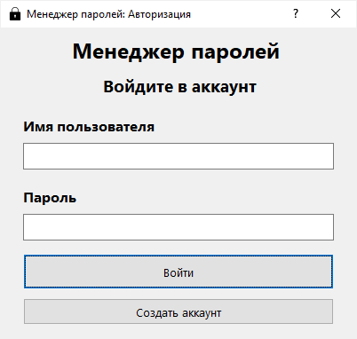
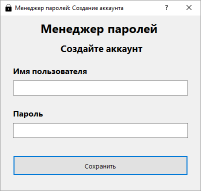
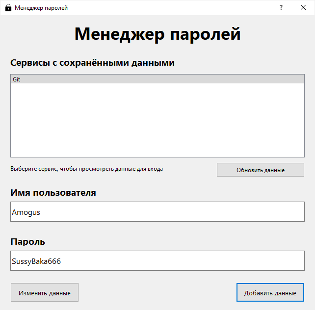
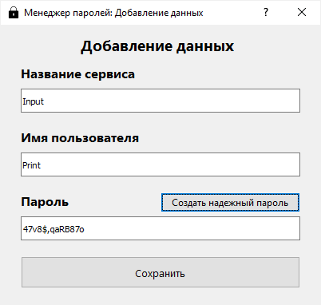

# Менеджер паролей

Менеджер паролей с графическим интерфейсом на базе библиотеки PyQT5.

В приложении используются база данных SQLite3 и библиотека для шифрования cryptography.

### Возможности:

* Создание нескольких аккаунтов
* Сохранение разных данных в разные аккаунты
* Просмотр сохранённых данных
* Добавление данных в базу данных с шифрованием паролей
* Изменение сохранённых данных
* Создание безопасного пароля из случайных символов при добавлении данных

### Интерфейсы:

* Авторизация с существующим аккаунтом

* Создание нового аккаунта

* Основное окно с данными

* Диалог добавления данных от сервисов

### База данных:

* Три таблицы: Accounts, Data, Logs
* Чтение и вывод данных в QListWidget на главном окне
* Запись данных через окно добавления данных
* Изменение данных в полях главного окна
* Все пароли сохраняются после шифрования, ключ хранится в отдельном файле

### Запуск приложения — PasswordManager.exe
#### Работает только при наличии созданной базы данных passwords.db с помощью скрипта DatabaseCreator.py, а также файла .env в одной директории с .exe-файлом.
#### Чтобы в заголовке окна отображалась иконка, необходимо её поместить в одну директорию с .exe-файлом.

